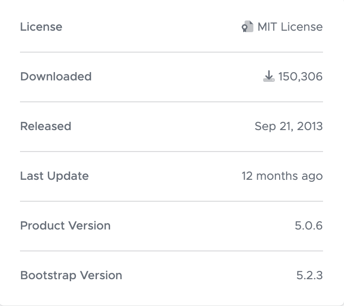

# Start Boot Strap

This code is downloaded from the [Start Bootstrap](https://startbootstrap.com/) website. It is used to create a [small business website](https://startbootstrap.com/template/small-business).  This free version is licensed under MIT.

## Start Bootstrap License
This software includes the start Bootstrap: Copyright (C) 2023 

Permission is hereby granted, free of charge, to any person obtaining a copy of this software and associated documentation files (the "Software"), to deal in the Software without restriction, including without limitation the rights to use, copy, modify, merge, publish, distribute, sublicense, and/or sell copies of the Software, and to permit persons to whom the Software is furnished to do so, subject to the following conditions:

The above copyright notice and this permission notice shall be included in all copies or substantial portions of the Software.

## Content Sources

### Images

[Fake Image](https://betterplaceholder.com/)

[Raw Pixel Public Domain Collection](https://www.rawpixel.com/public-domain/rawpixel-collection)

[Picsum Photos](https://picsum.photos/) 

[Unsplash](https://unsplash.com/)

[Pexels](https://www.pexels.com/)

### Text

[Lorem Picsum](https://loremipsum.io/)

[Chat GPI AI](https://chatgpt.com/)

### Fonts

[Google Fonts](https://fonts.google.com/)
